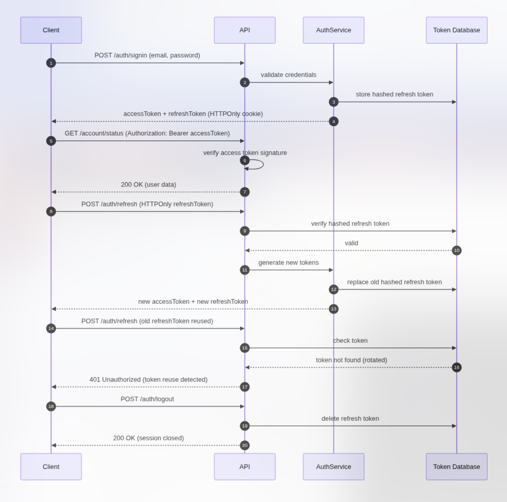

# Token Flow — JWT Access & Refresh (with Rotation)

This document describes the complete authentication system based on JWT Access Tokens, Refresh Tokens, and Refresh Token Rotation used in the NestJS API.

It covers:

- Sign-in
- Accessing protected routes
- Refresh tokens
- Secure rotation
- Attack detection
- Logout
- Server-side and client-side storage

## 1. Key Concepts

### Access Token

- Short-lived (e.g., 15 minutes)
- Contains the user's identity
- Signed with `JWT_ACCESS_TOKEN_SECRET`
- Never stored on the server side
- Used in the `Authorization: Bearer <token>` header

### Refresh Token

- Used to obtain a new pair of tokens
- Stored on the client side in an HTTPOnly cookie
- Stored on the server side as a hash
- Signed with `JWT_REFRESH_TOKEN_SECRET`

### Refresh Token Rotation

Each time `/auth/refresh` is called:

- A new refresh token is generated
- The old one is invalidated in the database
- This allows for attack detection (stolen tokens)

## 2. Complete Sequence Diagram

This diagram represents the full flow: sign-in → access → refresh → rotation → detection → logout.

## 3. Operational Details

### 3.1 Sign-in

1. The client sends email + password.
2. The server validates the credentials.
3. The server generates:
- An Access Token (short duration)
- A Refresh Token (long duration)

4. The refresh token is:
- Sent to the client (HTTPOnly cookie)
- Hashed and stored in the database

### 3.2 Accessing a Protected Route

5. The client sends the access token in the `Authorization` header.
6. The server verifies:
- The signature
- The expiration

7. If OK → access granted.

### 3.3 Refresh Token Rotation

8. The client sends the refresh token (via HTTPOnly cookie).
9. The server verifies the hash in the database.
10. If valid:
- Generates a new token pair.
- Replaces the old refresh token in the database.

11. The client receives the new tokens.

### 3.4 Stolen Refresh Token Detection

12. If a hacker reuses an old refresh token:
13. It no longer exists in the database.
14. The server detects a replay attack.
15. Response: 401 Unauthorized.

### 3.5 Logout

16. The client calls `/auth/logout`.
17. The server deletes the refresh token from the database.
18. The client is immediately disconnected.

 

  <a href="../index.md">⬅ Back to index</a>

